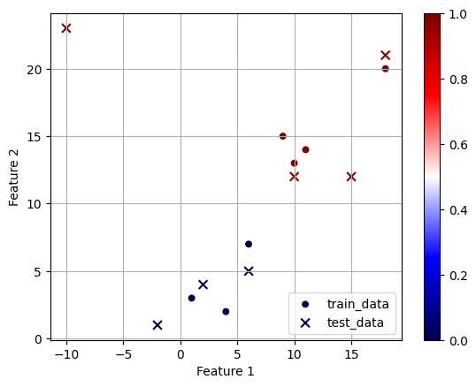

# K Nearest Neighbors Classifier

This repository is for a machine learning algorithm called KNN, which takes the majority class of the k nearest points to our new datapoint.

KNN Classifier Visual

